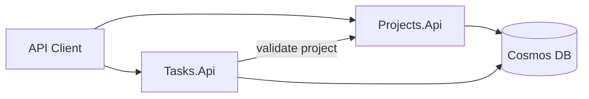

# TNTU Internship 2026 — Team Task Board

A **1-month student internship project** building a minimal **microservices-based task board** with **ASP.NET Core**, **EF Core**, **Azure Cosmos DB**, and **GitHub Actions** CI/CD.

Students implement two cooperating APIs — **Projects** and **Tasks** — deploy them to Azure free tier, and learn modern backend development practices along the way.

---

## What you will build

| Service | Responsibility |
|---------|----------------|
| **Projects.Api** | Create, list, update, and archive projects |
| **Tasks.Api** | Manage tasks within projects; validates projects via HTTP |



Implementation code will live under `src/` when development begins. This repository currently contains **project documentation only**.

---

## Documentation

Start here based on your role:

| Document | Audience | Description |
|----------|----------|-------------|
| [Development Prerequisites](docs/prerequisites/development-prerequisites.md) | Students (Day 1) | Software to install, Azure/GitHub accounts, environment variables |
| [Architecture and Tech Stack](docs/architecture/architecture-and-tech-stack.md) | Students, mentors | System design, conventions, ADRs, learning links |
| [System Overview](docs/domain/system-overview.md) | Students, mentors | Domain model, business rules, entity definitions |
| [One-Month Schedule](docs/internship-plan/one-month-schedule.md) | Students, mentors | Week-by-week plan, demo script, grading rubric |
| [User Stories](docs/user-stories/README.md) | Students | 19 user stories with acceptance criteria and API contracts |

---

## Quick start for students

1. Complete the [prerequisites checklist](docs/prerequisites/development-prerequisites.md#verification-steps).
2. Read [architecture](docs/architecture/architecture-and-tech-stack.md) and [domain overview](docs/domain/system-overview.md).
3. Follow the [Week 1 schedule](docs/internship-plan/one-month-schedule.md#week-1--environment-and-projects-api-foundation).
4. Implement user stories in order starting with [US-001](docs/user-stories/US-001-create-project.md).

---

## Tech stack

| Layer | Technology |
|-------|------------|
| Runtime | .NET 8 |
| API framework | ASP.NET Core Web API |
| ORM | Entity Framework Core + Cosmos DB provider |
| Database | Azure Cosmos DB (free tier) |
| Hosting | Azure App Service F1 |
| Observability | Azure Application Insights |
| CI/CD | GitHub Actions |
| Testing | xUnit |
| Optional | Docker, Docker Compose |

Full details and documentation links: [Architecture and Tech Stack](docs/architecture/architecture-and-tech-stack.md).

---

## User stories at a glance

| Sprint | Stories | Focus |
|--------|---------|-------|
| Week 1 | US-001 – US-003 | Projects API — create, list, get |
| Week 2 | US-004 – US-008 | Projects complete + Tasks API start |
| Week 3 | US-009 – US-015, US-019 | Tasks complete + Azure + CI/CD + observability |
| Week 4 | US-016 – US-018 (optional) | Filter, Docker, final demo |

Full index: [User Stories](docs/user-stories/README.md).

---

## Repository structure

```
TNTU.Internship2026/
├── README.md
└── docs/
    ├── architecture/
    │   └── architecture-and-tech-stack.md
    ├── prerequisites/
    │   └── development-prerequisites.md
    ├── domain/
    │   └── system-overview.md
    ├── internship-plan/
    │   └── one-month-schedule.md
    └── user-stories/
        ├── README.md
        └── US-001-create-project.md … US-019-application-insights.md
```

Planned source layout (created during Week 1):

```
src/
├── Projects.Api/
├── Projects.Api.Tests/
├── Tasks.Api/
├── Tasks.Api.Tests/
└── docker-compose.yml          # optional, week 4
```

---

## License and usage

This project is intended for educational use at TNTU. Mentors may adapt documentation and scope as needed.
