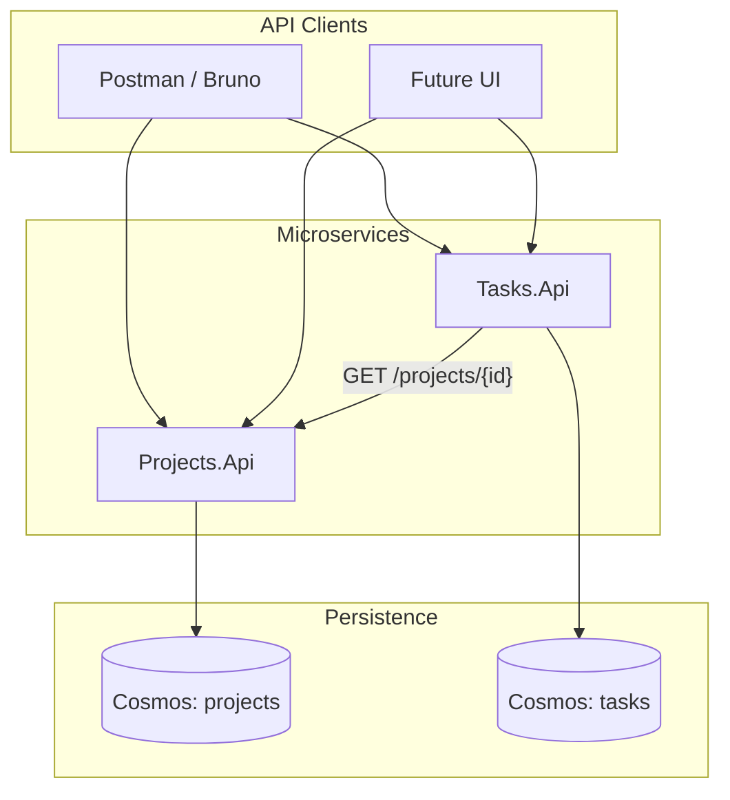
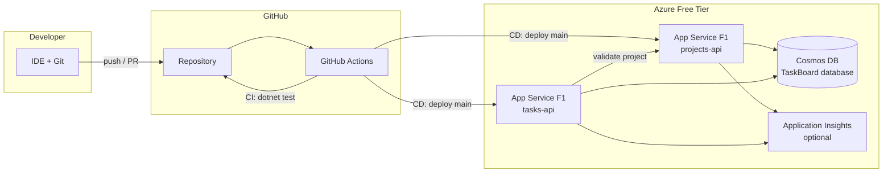
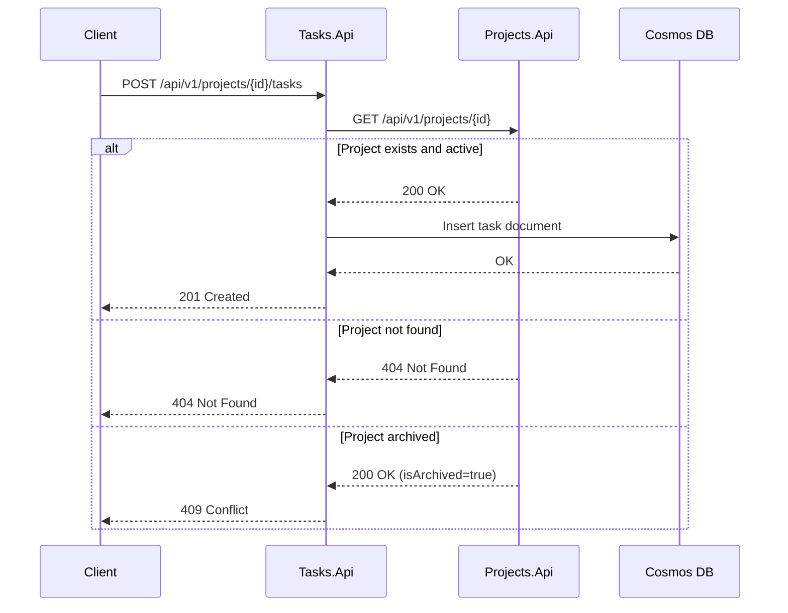
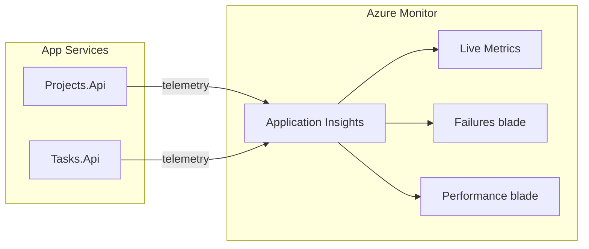

# Architecture and Tech Stack

## Team Task Board — TNTU Internship 2026

This document describes the system architecture, technology choices, and conventions for the internship project. Read it before writing code or provisioning Azure resources.

---

## Table of Contents

1. [Goals and Constraints](#goals-and-constraints)
2. [Logical Architecture](#logical-architecture)
3. [Physical Architecture](#physical-architecture)
4. [Service Boundaries](#service-boundaries)
5. [Data Model Overview](#data-model-overview)
6. [API Design Conventions](#api-design-conventions)
7. [Cross-Service Communication](#cross-service-communication)
8. [Security Baseline](#security-baseline)
9. [Observability](#observability)
10. [CI/CD Pipeline](#cicd-pipeline)
11. [Optional Docker Support](#optional-docker-support)
12. [Tech Stack Reference](#tech-stack-reference)
13. [Architecture Decision Records](#architecture-decision-records)
14. [Risks and Mitigations](#risks-and-mitigations)

---

## Goals and Constraints

| Goal | Description |
|------|-------------|
| Learn microservices | Build and deploy two independent HTTP APIs that cooperate without sharing a database |
| Learn cloud deployment | Host on Azure using free-tier services only |
| Learn CI/CD | Automate testing and deployment with GitHub Actions |
| Deliver in 1 month | Scope is intentionally small; polish comes after a working end-to-end demo |

| Constraint | Implication |
|------------|-------------|
| Azure free tier only | F1 App Service, Cosmos DB free tier (1000 RU/s), no paid SKUs unless mentor approves |
| No authentication in v1 | APIs are open; document auth as future work |
| Two microservices max | Projects.Api and Tasks.Api — no API gateway in v1 |
| Synchronous HTTP only | No message bus, no event sourcing in v1 |

---

## Logical Architecture

The system is split into two bounded contexts:



**Key principles:**

- Each service owns its data — no direct database access across service boundaries.
- Tasks.Api validates that a project exists by calling Projects.Api over HTTP.
- Services are deployed independently and can be versioned separately.

---

## Physical Architecture



### Azure resource naming convention

Use a consistent prefix, for example `tntu-taskboard-<initials>`:

| Resource | Suggested name | SKU |
|----------|----------------|-----|
| Resource group | `rg-tntu-taskboard` | — |
| Cosmos DB account | `cosmos-tntu-taskboard` | Free tier enabled |
| App Service plan | `asp-tntu-taskboard` | F1 (Free) |
| Projects web app | `app-tntu-projects-api` | F1 |
| Tasks web app | `app-tntu-tasks-api` | F1 |
| Application Insights | `appi-tntu-taskboard` | Free (optional) |

Both web apps can share a single App Service plan on the free tier.

---

## Service Boundaries

### Projects.Api

**Responsibility:** Manage project metadata (create, read, update, archive).

| Capability | Endpoint prefix |
|------------|-----------------|
| Project CRUD | `/api/v1/projects` |
| Health | `/health` |

**Does not:** Create or manage tasks, know about task status.

### Tasks.Api

**Responsibility:** Manage tasks within projects (create, read, update, delete, status transitions).

| Capability | Endpoint prefix |
|------------|-----------------|
| Task CRUD + status | `/api/v1/projects/{projectId}/tasks` |
| Health | `/health` |

**Does:** Call Projects.Api to verify a project exists and is not archived before creating a task.

### Future code layout

```
src/
├── Projects.Api/
├── Projects.Api.Tests/
├── Tasks.Api/
├── Tasks.Api.Tests/
└── docker-compose.yml          # optional, week 4
```

---

## Data Model Overview

### Cosmos DB layout

Single Cosmos DB account (free tier), one database, two containers:

| Database | Container | Partition key | Entity |
|----------|-----------|---------------|--------|
| `TaskBoard` | `projects` | `/id` | `Project` |
| `TaskBoard` | `tasks` | `/projectId` | `TaskItem` |

> **Note:** Name the C# entity `TaskItem` (not `Task`) to avoid conflict with `System.Threading.Tasks.Task`.

### Project entity

```json
{
  "id": "3fa85f64-5717-4562-b3fc-2c963f66afa6",
  "name": "Internship Backend",
  "description": "Build the task board APIs",
  "isArchived": false,
  "createdAt": "2026-07-01T10:00:00Z"
}
```

### TaskItem entity

```json
{
  "id": "7c9e6679-7425-40de-944b-e07fc1f90ae7",
  "projectId": "3fa85f64-5717-4562-b3fc-2c963f66afa6",
  "title": "Implement create project endpoint",
  "description": "US-001",
  "status": "ToDo",
  "assignee": "student@tntu.edu.ua",
  "dueDate": "2026-07-15T00:00:00Z",
  "createdAt": "2026-07-01T10:00:00Z",
  "updatedAt": "2026-07-01T10:00:00Z"
}
```

### EF Core configuration highlights

- Use the [EF Core Cosmos DB provider](https://learn.microsoft.com/en-us/ef/core/providers/cosmos/).
- Map `id` as the document key; use `ToJsonProperty` or explicit column mapping for camelCase JSON.
- Partition key for tasks must match `projectId` on every write and point read.

**Learning resources:**

- [EF Core with Azure Cosmos DB](https://learn.microsoft.com/en-us/ef/core/providers/cosmos/)
- [Partitioning in Cosmos DB](https://learn.microsoft.com/en-us/azure/cosmos-db/partitioning-overview)

---

## API Design Conventions

### General rules

| Rule | Value |
|------|-------|
| Style | REST over HTTPS |
| Version prefix | `/api/v1/` |
| Request/response format | JSON (`application/json`) |
| Identifiers | GUID (`uuid`) |
| Timestamps | ISO 8601 UTC (`DateTimeOffset`) |
| Error format | [RFC 7807 Problem Details](https://datatracker.ietf.org/doc/html/rfc7807) |

### HTTP status codes

| Code | Usage |
|------|-------|
| `200 OK` | Successful GET, PUT, PATCH |
| `201 Created` | Successful POST with `Location` header |
| `204 No Content` | Successful DELETE |
| `400 Bad Request` | Validation failure |
| `404 Not Found` | Resource does not exist |
| `409 Conflict` | Business rule violation (e.g., invalid status transition) |
| `502 Bad Gateway` | Tasks.Api cannot reach Projects.Api |
| `503 Service Unavailable` | Health check failure / dependency down |

### Example Problem Details response

```json
{
  "type": "https://tools.ietf.org/html/rfc7231#section-6.5.1",
  "title": "Validation failed",
  "status": 400,
  "detail": "Project name is required.",
  "instance": "/api/v1/projects"
}
```

ASP.NET Core supports Problem Details out of the box:

- [Problem Details in ASP.NET Core](https://learn.microsoft.com/en-us/aspnet/core/web-api/#problem-details)

### OpenAPI / Swagger

Enable Swagger UI in Development environment for manual testing:

- [Swagger / OpenAPI in ASP.NET Core](https://learn.microsoft.com/en-us/aspnet/core/tutorials/web-api-help-pages-using-swagger)

---

## Cross-Service Communication

### When Tasks.Api calls Projects.Api

| Trigger | HTTP call | On success | On failure |
|---------|-----------|------------|------------|
| Create task | `GET /api/v1/projects/{projectId}` | Proceed if `200` and `isArchived == false` | `404` → return 404; archived → return 409 |
| List tasks by project | `GET /api/v1/projects/{projectId}` | Proceed if `200` | `404` → return 404 |



### HttpClient registration

Register a typed `HttpClient` in Tasks.Api with a configurable base URL:

```csharp
// appsettings.json
{
  "ProjectsApi": {
    "BaseUrl": "https://app-tntu-projects-api.azurewebsites.net"
  }
}
```

**Learning resources:**

- [Make HTTP requests with HttpClientFactory](https://learn.microsoft.com/en-us/aspnet/core/fundamentals/http-requests)
- [Polly resilience policies](https://www.pollydocs.org/) (optional retry for transient failures)

---

## Security Baseline

### v1 (internship scope)

| Topic | Decision |
|-------|----------|
| Authentication | None — all endpoints are public |
| Authorization | None |
| Transport | HTTPS enforced in Azure App Service |
| Secrets | Cosmos DB keys and deployment credentials stored in GitHub Secrets / App Service configuration — never committed to Git |

### Future work

- [Microsoft Entra ID](https://learn.microsoft.com/en-us/entra/identity-platform/v2-overview) for OAuth 2.0 / OpenID Connect
- API keys or JWT validation middleware per service
- Azure Key Vault for secret management

---

## Observability

Observability means understanding system behavior from the outside — what requests are flowing, how long they take, what failed, and why — without attaching a debugger to production. For this internship, observability is a **required** topic implemented with **Azure Application Insights**.

### The three pillars (simplified)

| Pillar | What it answers | How we implement it |
|--------|-----------------|---------------------|
| **Logs** | What happened? | `ILogger<T>` → Application Insights traces |
| **Metrics** | How much / how fast? | Request duration, dependency duration, failure rate |
| **Traces** | What path did a request take? | End-to-end request telemetry with dependency spans |

### Architecture



Both APIs send telemetry to a **shared** Application Insights resource (free tier: 5 GB/month ingestion). Each App Service is linked via the `APPLICATIONINSIGHTS_CONNECTION_STRING` application setting.

### What to collect

| Signal | Source | Example |
|--------|--------|---------|
| HTTP requests | Auto-instrumentation | `POST /api/v1/projects` — 201, 45 ms |
| Outgoing HTTP | Tasks.Api → Projects.Api | Dependency type `Http`, target host |
| Cosmos DB calls | EF Core / SDK | Dependency type `Azure DocumentDB` |
| Exceptions | Unhandled + logged | Validation errors, 502 from upstream |
| Custom events | `ILogger` | `"Creating project {Name}"` |
| Health checks | ASP.NET Core | `/health` request duration |

### Implementation pattern

**NuGet package (both APIs):**

```
Microsoft.ApplicationInsights.AspNetCore
```

**Registration in `Program.cs`:**

```csharp
builder.Services.AddApplicationInsightsTelemetry();
```

**Configuration (App Service application setting):**

```
APPLICATIONINSIGHTS_CONNECTION_STRING=InstrumentationKey=...;IngestionEndpoint=...
```

> When creating App Service resources, enable Application Insights in the Azure Portal wizard or link an existing resource. The connection string is injected automatically.

**Structured logging example:**

```csharp
_logger.LogInformation("Creating task {TaskTitle} for project {ProjectId}", title, projectId);
```

### Local development

- Telemetry can be disabled locally via `appsettings.Development.json`:

```json
{
  "ApplicationInsights": {
    "EnableAdaptiveSampling": false
  },
  "Logging": {
    "ApplicationInsights": {
      "LogLevel": {
        "Default": "Information"
      }
    }
  }
}
```

- Leave `APPLICATIONINSIGHTS_CONNECTION_STRING` unset locally to avoid polluting cloud telemetry, or use a separate dev Application Insights resource.

### Minimum (required)

- ASP.NET Core built-in logging (`ILogger<T>`) with structured log messages
- Application Insights connected in Azure for both APIs ([US-019](../user-stories/US-019-application-insights.md))
- Health check endpoints (`/health`) — see [US-012](../user-stories/US-012-health-checks.md)
- App Service log stream for quick debugging during deployment

### Verification checklist (Week 3)

After deploying to Azure and completing US-019:

1. Open Application Insights → **Transaction search** — see API requests after running the demo.
2. Open **Application map** — see Projects.Api, Tasks.Api, Cosmos DB, and HTTP dependency between services.
3. Open **Failures** — trigger a 404 and confirm it appears.
4. Open **Live Metrics** — watch requests in real time during demo.

**Learning resources:**

- [Application Insights overview](https://learn.microsoft.com/en-us/azure/azure-monitor/app/app-insights-overview)
- [Application Insights for ASP.NET Core](https://learn.microsoft.com/en-us/azure/azure-monitor/app/asp-net-core)
- [Logging in .NET](https://learn.microsoft.com/en-us/dotnet/core/extensions/logging)
- [Log in .NET with Application Insights](https://learn.microsoft.com/en-us/azure/azure-monitor/app/asp-net-core#logging-in-aspnet-core-applications)
- [Application map](https://learn.microsoft.com/en-us/azure/azure-monitor/app/app-map)
- [Live Metrics](https://learn.microsoft.com/en-us/azure/azure-monitor/app/live-stream)
- [Health checks in ASP.NET Core](https://learn.microsoft.com/en-us/aspnet/core/host-and-deploy/health-checks)
- [Monitor App Service with Application Insights](https://learn.microsoft.com/en-us/azure/azure-monitor/app/azure-web-apps-overview)

---

## CI/CD Pipeline

### Continuous Integration (every PR and push)

```yaml
# .github/workflows/ci.yml (conceptual)
on: [pull_request, push]
jobs:
  test:
    runs-on: ubuntu-latest
    steps:
      - uses: actions/checkout@v4
      - uses: actions/setup-dotnet@v4
        with:
          dotnet-version: '8.0.x'
      - run: dotnet restore
      - run: dotnet test --no-restore
```

### Continuous Deployment (merge to `main`)

Deploy each API to its own App Service. Two recommended approaches:

| Approach | Pros | Documentation |
|----------|------|---------------|
| **OIDC (recommended)** | No long-lived credentials in GitHub | [Deploy to Azure from GitHub Actions](https://learn.microsoft.com/en-us/azure/developer/github/connect-from-azure) |
| Publish profile | Simpler initial setup | [App Service deployment credentials](https://learn.microsoft.com/en-us/azure/app-service/deploy-github-actions) |

```yaml
# .github/workflows/cd.yml (conceptual)
on:
  push:
    branches: [main]
jobs:
  deploy-projects:
    runs-on: ubuntu-latest
    steps:
      - uses: actions/checkout@v4
      - uses: actions/setup-dotnet@v4
      - run: dotnet publish src/Projects.Api -c Release -o ./publish
      - uses: azure/webapps-deploy@v3
        with:
          app-name: app-tntu-projects-api
          # credentials via OIDC or publish-profile
```

**Learning resources:**

- [GitHub Actions documentation](https://docs.github.com/en/actions)
- [GitHub Actions for .NET](https://docs.github.com/en/actions/automating-builds-and-tests/building-and-testing-net)
- [Azure App Service deployment](https://learn.microsoft.com/en-us/azure/app-service/deploy-best-practices)

---

## Optional Docker Support

Docker is a **week 4 stretch goal** (user stories US-017, US-018).

### Goals

- Dockerfile per API service (multi-stage build)
- `docker-compose.yml` to run both APIs locally
- Cosmos DB Emulator or cloud Cosmos for persistence

### Example Dockerfile pattern

```dockerfile
FROM mcr.microsoft.com/dotnet/sdk:8.0 AS build
WORKDIR /src
COPY . .
RUN dotnet publish Projects.Api -c Release -o /app/publish

FROM mcr.microsoft.com/dotnet/aspnet:8.0
WORKDIR /app
COPY --from=build /app/publish .
ENTRYPOINT ["dotnet", "Projects.Api.dll"]
```

**Learning resources:**

- [Docker tutorial](https://docs.docker.com/get-started/)
- [Docker Compose overview](https://docs.docker.com/compose/)
- [Containerize a .NET app](https://learn.microsoft.com/en-us/dotnet/core/docker/build-container)
- [Cosmos DB Emulator](https://learn.microsoft.com/en-us/azure/cosmos-db/local-emulator)

---

## Tech Stack Reference

| Technology | Version | Role | Documentation |
|------------|---------|------|---------------|
| .NET | 8.0 LTS | Runtime and SDK | [What's new in .NET 8](https://learn.microsoft.com/en-us/dotnet/core/whats-new/dotnet-8) |
| ASP.NET Core | 8.0 | Web API framework | [ASP.NET Core docs](https://learn.microsoft.com/en-us/aspnet/core/) |
| ASP.NET Core Web API | 8.0 | REST endpoints | [Create web APIs](https://learn.microsoft.com/en-us/aspnet/core/web-api/) |
| Entity Framework Core | 8.0 | ORM | [EF Core docs](https://learn.microsoft.com/en-us/ef/core/) |
| EF Core Cosmos provider | 8.0 | Cosmos DB persistence | [Cosmos DB provider](https://learn.microsoft.com/en-us/ef/core/providers/cosmos/) |
| xUnit | 2.x | Unit testing | [Getting started with xUnit](https://xunit.net/docs/getting-started/v2/getting-started) |
| FluentAssertions | 6.x | Readable test assertions (optional) | [FluentAssertions docs](https://fluentassertions.com/introduction) |
| Azure Cosmos DB | — | NoSQL database | [Cosmos DB docs](https://learn.microsoft.com/en-us/azure/cosmos-db/) |
| Azure Cosmos DB free tier | — | 1000 RU/s, 25 GB | [Free tier](https://learn.microsoft.com/en-us/azure/cosmos-db/free-tier) |
| Azure App Service | F1 | API hosting | [App Service overview](https://learn.microsoft.com/en-us/azure/app-service/) |
| Azure App Service plans | F1 Free | Compute | [Hosting plans](https://learn.microsoft.com/en-us/azure/app-service/overview-hosting-plans) |
| GitHub Actions | — | CI/CD | [GitHub Actions docs](https://docs.github.com/en/actions) |
| Azure CLI | 2.x | Resource provisioning | [Azure CLI docs](https://learn.microsoft.com/en-us/cli/azure/) |
| Docker | — | Containerization (optional) | [Get started](https://docs.docker.com/get-started/) |
| Docker Compose | — | Local orchestration (optional) | [Compose docs](https://docs.docker.com/compose/) |
| Cosmos DB Emulator | — | Local DB on Windows (optional) | [Local emulator](https://learn.microsoft.com/en-us/azure/cosmos-db/local-emulator) |
| Application Insights | — | Monitoring (optional) | [Application Insights](https://learn.microsoft.com/en-us/azure/azure-monitor/app/app-insights-overview) |
| Polly | 8.x | HTTP resilience (optional) | [Polly docs](https://www.pollydocs.org/) |

---

## Architecture Decision Records

### ADR-001: Use Azure Cosmos DB instead of Azure SQL

| | |
|---|---|
| **Status** | Accepted |
| **Context** | Need a cloud database on free tier; internship focuses on modern Azure services |
| **Decision** | Use Cosmos DB with EF Core Cosmos provider |
| **Consequences** | Students learn NoSQL partitioning; queries differ from relational SQL; free tier limited to one account per subscription |
| **Alternatives** | Azure SQL (not free tier); SQLite (not suitable for multi-instance cloud deploy) |

### ADR-002: Two microservices without API Gateway

| | |
|---|---|
| **Status** | Accepted |
| **Context** | 1-month timeline; goal is to learn service boundaries, not infrastructure complexity |
| **Decision** | Two services (Projects, Tasks) called directly by clients and each other |
| **Consequences** | Clients need two base URLs; CORS must be configured if a browser UI is added later |
| **Alternatives** | API Gateway (Azure API Management — not free); BFF pattern (extra service) |

### ADR-003: Synchronous HTTP for cross-service validation

| | |
|---|---|
| **Status** | Accepted |
| **Context** | Task creation must verify project existence |
| **Decision** | Tasks.Api calls Projects.Api synchronously via HttpClient |
| **Consequences** | Projects.Api downtime blocks task creation; acceptable for v1 |
| **Alternatives** | Event-driven (Service Bus — adds cost and complexity); shared database (violates microservice principles) |

### ADR-004: No authentication in v1

| | |
|---|---|
| **Status** | Accepted |
| **Context** | Authentication adds significant scope; primary learning goals are APIs, EF Core, Azure, CI/CD |
| **Decision** | Defer auth to a future iteration |
| **Consequences** | APIs must not be exposed publicly beyond the internship demo; use Azure access restrictions if needed |
| **Alternatives** | API keys; Entra ID OAuth |

### ADR-005: GitHub Actions OIDC for Azure deployment

| | |
|---|---|
| **Status** | Recommended |
| **Context** | CD requires Azure credentials in GitHub |
| **Decision** | Prefer OIDC federated credentials over storing publish profile passwords |
| **Consequences** | One-time Azure setup is more complex; long-term security is better |
| **Alternatives** | Publish profile secret; Azure DevOps pipelines |

---

## Risks and Mitigations

| Risk | Impact | Mitigation |
|------|--------|------------|
| F1 App Service 60 min/day CPU quota | APIs become unresponsive | Develop locally; use Azure for demos and CI/CD verification only |
| F1 cold starts | Slow first request after idle | Enable "Always On" is not available on F1 — warm up before demos |
| Cosmos DB free tier — one account per subscription | Students share one account | Use separate containers; mentor provisions shared account |
| Cross-service network failures | Task creation fails | Return `502 Bad Gateway` with clear message; optional Polly retry |
| Secrets committed to Git | Security incident | Use `.gitignore`, GitHub Secret scanning, code review checklist |
| Scope creep | Miss 1-month deadline | Follow [user stories](../user-stories/README.md) priorities; Docker is optional |

---

## Related Documentation

- [Development Prerequisites](../prerequisites/development-prerequisites.md)
- [System Overview (Domain)](../domain/system-overview.md)
- [One-Month Schedule](../internship-plan/one-month-schedule.md)
- [User Stories Index](../user-stories/README.md)
