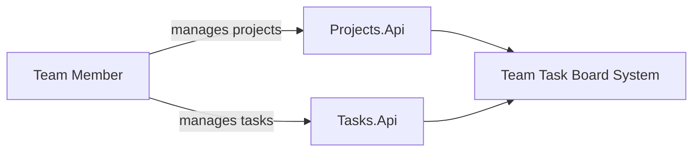
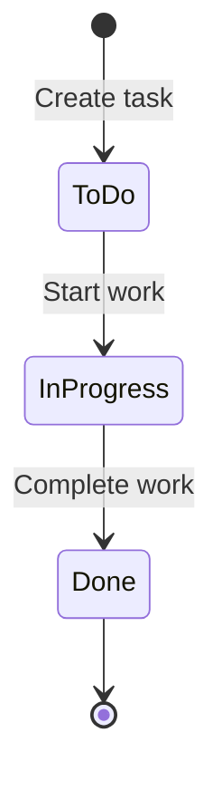
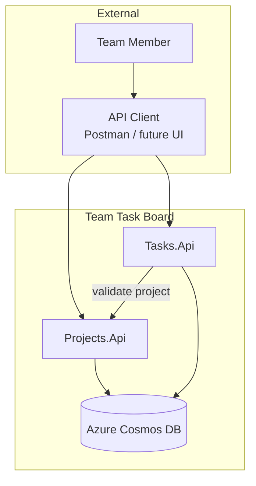

# System Overview — Team Task Board

## Domain Description

### Problem Statement

Small teams — student project groups, internship squads, or startup teams — need a lightweight way to organize work. They do not need the full complexity of enterprise tools like Jira. They need to:

1. Create **projects** that represent a body of work (e.g., "Backend API", "Mobile App").
2. Add **tasks** to each project with a clear status (To Do, In Progress, Done).
3. Track who is working on what and when work is due.

The **Team Task Board** system solves this with two cooperating microservices: one for projects, one for tasks.

---

## Table of Contents

1. [Glossary](#glossary)
2. [Actors](#actors)
3. [Core Concepts](#core-concepts)
4. [Business Rules](#business-rules)
5. [Entity Definitions](#entity-definitions)
6. [Task Status Lifecycle](#task-status-lifecycle)
7. [System Context Diagram](#system-context-diagram)
8. [Typical User Flows](#typical-user-flows)
9. [Out of Scope (v1)](#out-of-scope-v1)
10. [Future Extensions](#future-extensions)

---

## Glossary

| Term | Definition |
|------|------------|
| **Project** | A container for related tasks. Represents a goal, product, or work stream. Example: "Internship 2026 API". |
| **Task** | A single unit of work within a project. Has a title, optional description, status, and optional assignee. |
| **Status** | The current stage of a task in its lifecycle: `ToDo`, `InProgress`, or `Done`. |
| **Assignee** | A free-text identifier (typically an email) of the person responsible for the task. |
| **Archive** | A soft-delete state for a project. Archived projects remain in the database but are hidden from default lists and cannot receive new tasks. |
| **Team Member** | A person who creates projects, adds tasks, and updates task status. In v1, all users have the same permissions. |

---

## Actors



### Team Member (primary actor)

- Creates and manages projects.
- Creates tasks within projects.
- Updates task details and moves tasks through statuses.
- Views project and task lists.

### System Administrator (v1 — same as Team Member)

In v1 there is no role separation. The "administrator" actor is documented for future use when authentication and authorization are added. All API operations are available to any caller.

---

## Core Concepts

### Project as a boundary

A **project** groups related tasks. Every task belongs to exactly one project. Projects exist independently — you can create a project with zero tasks.

### Task as work item

A **task** is the smallest trackable unit. It always references a `projectId`. Tasks cannot be moved between projects in v1.

### Service ownership

| Concept | Owning service |
|---------|----------------|
| Project metadata | Projects.Api |
| Task metadata and status | Tasks.Api |
| Project existence validation | Projects.Api (queried by Tasks.Api) |

---

## Business Rules

### Project rules

| ID | Rule |
|----|------|
| BR-P01 | A project name is required and must not exceed 100 characters. |
| BR-P02 | A project description is optional and must not exceed 500 characters. |
| BR-P03 | A newly created project is not archived (`isArchived = false`). |
| BR-P04 | Archiving a project is a soft delete — the record is retained in the database. |
| BR-P05 | Archived projects do not appear in the default project list. |
| BR-P06 | A project can be retrieved by ID even if archived (for auditing). |

### Task rules

| ID | Rule |
|----|------|
| BR-T01 | A task must belong to an existing, non-archived project. |
| BR-T02 | A task title is required and must not exceed 200 characters. |
| BR-T03 | A task description is optional and must not exceed 2000 characters. |
| BR-T04 | A newly created task has status `ToDo`. |
| BR-T05 | Status transitions must follow the allowed lifecycle (see diagram below). Skipping states is not allowed in v1. |
| BR-T06 | `Assignee` is optional free text (max 200 characters). |
| BR-T07 | `DueDate`, if provided, must be a valid UTC date. Past due dates are allowed (no validation in v1). |
| BR-T08 | Deleting a task permanently removes it from the database. |
| BR-T09 | Archiving a project does not delete its tasks, but no new tasks can be added. |

### Cross-service rules

| ID | Rule |
|----|------|
| BR-X01 | Tasks.Api must call Projects.Api to verify project existence before creating a task. |
| BR-X02 | If Projects.Api is unavailable, Tasks.Api returns `502 Bad Gateway`. |
| BR-X03 | If the project is archived, task creation returns `409 Conflict`. |

---

## Entity Definitions

### Project

| Field | Type | Required | Constraints | Description |
|-------|------|----------|-------------|-------------|
| `id` | `Guid` | Yes (system) | UUID v4 | Unique identifier; also Cosmos partition key |
| `name` | `string` | Yes | 1–100 chars | Display name |
| `description` | `string` | No | Max 500 chars | Optional details |
| `isArchived` | `bool` | Yes (default: `false`) | — | Soft-delete flag |
| `createdAt` | `DateTimeOffset` | Yes (system) | UTC | Creation timestamp |

**Example:**

```json
{
  "id": "3fa85f64-5717-4562-b3fc-2c963f66afa6",
  "name": "Internship Backend",
  "description": "Build Projects and Tasks microservices",
  "isArchived": false,
  "createdAt": "2026-07-01T08:00:00Z"
}
```

### TaskItem

| Field | Type | Required | Constraints | Description |
|-------|------|----------|-------------|-------------|
| `id` | `Guid` | Yes (system) | UUID v4 | Unique identifier |
| `projectId` | `Guid` | Yes | Must reference existing project | Foreign key via service call |
| `title` | `string` | Yes | 1–200 chars | Short summary |
| `description` | `string` | No | Max 2000 chars | Detailed notes |
| `status` | `TaskStatus` enum | Yes (default: `ToDo`) | `ToDo`, `InProgress`, `Done` | Current lifecycle state |
| `assignee` | `string` | No | Max 200 chars | Responsible person |
| `dueDate` | `DateTimeOffset` | No | UTC | Optional deadline |
| `createdAt` | `DateTimeOffset` | Yes (system) | UTC | Creation timestamp |
| `updatedAt` | `DateTimeOffset` | Yes (system) | UTC | Last modification timestamp |

**TaskStatus enum:**

```csharp
public enum TaskStatus
{
    ToDo = 0,
    InProgress = 1,
    Done = 2
}
```

**Example:**

```json
{
  "id": "7c9e6679-7425-40de-944b-e07fc1f90ae7",
  "projectId": "3fa85f64-5717-4562-b3fc-2c963f66afa6",
  "title": "Implement US-001 create project",
  "description": "POST /api/v1/projects endpoint with validation",
  "status": "InProgress",
  "assignee": "student@tntu.edu.ua",
  "dueDate": "2026-07-10T00:00:00Z",
  "createdAt": "2026-07-01T09:00:00Z",
  "updatedAt": "2026-07-03T14:30:00Z"
}
```

---

## Task Status Lifecycle

Tasks move through three states. Backward transitions are not allowed in v1.



| From | To | Allowed | API action |
|------|----|---------|------------|
| — | `ToDo` | Yes | Create task (default status) |
| `ToDo` | `InProgress` | Yes | PATCH status |
| `InProgress` | `Done` | Yes | PATCH status |
| `ToDo` | `Done` | **No** | Returns `409 Conflict` |
| `InProgress` | `ToDo` | **No** | Returns `409 Conflict` |
| `Done` | any | **No** | Returns `409 Conflict` |

---

## System Context Diagram



---

## Typical User Flows

### Flow 1: Start a new project with tasks

1. Team Member creates a project: `POST /api/v1/projects` → "Mobile App".
2. Team Member creates tasks:
   - `POST /api/v1/projects/{id}/tasks` → "Design wireframes"
   - `POST /api/v1/projects/{id}/tasks` → "Set up React project"
3. Team Member lists tasks: `GET /api/v1/projects/{id}/tasks`.

### Flow 2: Work a task through its lifecycle

1. Team Member views task: `GET /api/v1/projects/{projectId}/tasks/{taskId}`.
2. Team Member starts work: `PATCH` status to `InProgress`.
3. Team Member completes work: `PATCH` status to `Done`.
4. Team Member lists tasks filtered by status (optional, US-016): `GET ?status=Done`.

### Flow 3: Close a project

1. Team Member archives project: `PATCH /api/v1/projects/{id}/archive`.
2. Project no longer appears in default list.
3. Attempt to create a new task → `409 Conflict`.

---

## Out of Scope (v1)

The following are explicitly **not** part of the 1-month internship:

| Feature | Reason |
|---------|--------|
| User authentication and authorization | Significant extra scope; deferred to future iteration |
| User registration / login | Requires identity provider integration |
| Real-time updates (SignalR, WebSockets) | Not needed for API-first v1 |
| Task comments | Additional entity and API surface |
| File attachments | Requires blob storage integration |
| Email / push notifications | Requires messaging infrastructure |
| Task assignment validation (verify assignee exists) | No user directory in v1 |
| Moving tasks between projects | Adds complexity to partitioning |
| Subtasks / task hierarchy | Keep model flat for learning |
| Full-text search | Cosmos queries sufficient for v1 |
| Web UI | APIs only; UI is a future extension |
| API Gateway | Two services called directly |

---

## Future Extensions

| Extension | Technology | Benefit |
|-----------|------------|---------|
| Authentication | Microsoft Entra ID | Secure multi-user access |
| Web UI | Blazor or React SPA | User-friendly interface |
| API Gateway | Azure API Management or YARP | Single entry point, rate limiting |
| Event-driven sync | Azure Service Bus | Decouple services, eventual consistency |
| Blob storage | Azure Blob Storage | Task attachments |
| Caching | Azure Redis Cache | Reduce cross-service calls |
| Container hosting | Azure Container Apps | Move from App Service to containers |

---

## Related Documentation

- [Architecture and Tech Stack](../architecture/architecture-and-tech-stack.md)
- [Development Prerequisites](../prerequisites/development-prerequisites.md)
- [User Stories](../user-stories/README.md)
- [One-Month Schedule](../internship-plan/one-month-schedule.md)
