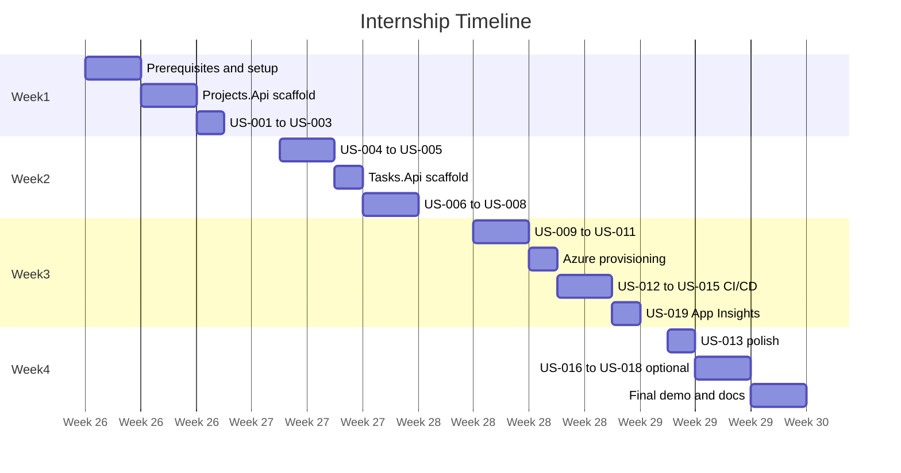

# One-Month Internship Schedule

## Team Task Board — TNTU Internship 2026

**Duration:** 4 weeks (20 working days)  
**Goal:** Deliver two deployed microservices with CI/CD, demonstrating a complete project-to-task workflow.

---

## Table of Contents

1. [Overview](#overview)
2. [Week 1 — Environment and Projects API Foundation](#week-1--environment-and-projects-api-foundation)
3. [Week 2 — Complete Projects API and Start Tasks API](#week-2--complete-projects-api-and-start-tasks-api)
4. [Week 3 — Complete Tasks API, Azure, and CI/CD](#week-3--complete-tasks-api-azure-and-cicd)
5. [Week 4 — Hardening, Optional Docker, and Final Demo](#week-4--hardening-optional-docker-and-final-demo)
6. [Daily Standup Format](#daily-standup-format)
7. [Code Review Checkpoints](#code-review-checkpoints)
8. [Minimum Viable Demo Script](#minimum-viable-demo-script)
9. [Grading Rubric (Suggested)](#grading-rubric-suggested)
10. [Related Documentation](#related-documentation)

---

## Overview

| Week | Theme | User stories | Exit criteria |
|------|-------|--------------|---------------|
| 1 | Setup + Projects API start | US-001 – US-003 | Create, list, and get projects locally |
| 2 | Projects complete + Tasks start | US-004 – US-008 | Both services run locally; create and list tasks |
| 3 | Tasks complete + cloud + CI/CD + observability | US-009 – US-015, US-019 | End-to-end flow in Azure; CI/CD green; telemetry in App Insights |
| 4 | Polish + optional + demo | US-016 – US-018 (optional) | Final presentation delivered |

---

## Week 1 — Environment and Projects API Foundation

**Focus:** Complete prerequisites, scaffold Projects.Api, connect to Cosmos DB, implement core project read operations.

### Day 1 (Monday) — Onboarding

- [ ] Read [Development Prerequisites](../prerequisites/development-prerequisites.md) and complete verification checklist
- [ ] Read [Architecture and Tech Stack](../architecture/architecture-and-tech-stack.md)
- [ ] Read [System Overview](../domain/system-overview.md)
- [ ] Install .NET 8 SDK, IDE, Git, Azure CLI
- [ ] Clone repository and create feature branch

### Day 2 (Tuesday) — Projects.Api scaffold

- [ ] Create `src/Projects.Api` (ASP.NET Core Web API, .NET 8)
- [ ] Create `src/Projects.Api.Tests` (xUnit)
- [ ] Add EF Core Cosmos DB packages
- [ ] Configure `Project` entity and `DbContext`
- [ ] Connect to Cosmos DB Emulator (or cloud Cosmos)
- [ ] Verify database and `projects` container are created on startup

**Learning:**

- [Create a web API with ASP.NET Core](https://learn.microsoft.com/en-us/aspnet/core/tutorials/first-web-api)
- [EF Core Cosmos DB provider](https://learn.microsoft.com/en-us/ef/core/providers/cosmos/)

### Day 3 (Wednesday) — US-001 Create project

- [ ] Implement [US-001](../user-stories/US-001-create-project.md)
- [ ] Write unit tests for validation logic
- [ ] Test with Postman/Bruno

### Day 4 (Thursday) — US-002 List projects

- [ ] Implement [US-002](../user-stories/US-002-list-projects.md)
- [ ] Exclude archived projects from default list
- [ ] Write unit/integration tests

### Day 5 (Friday) — US-003 Get project by ID

- [ ] Implement [US-003](../user-stories/US-003-get-project-by-id.md)
- [ ] Enable Swagger in Development
- [ ] **Checkpoint:** Code review with mentor (see [checkpoints](#code-review-checkpoints))

**Week 1 deliverable:** Projects.Api running locally with create, list, and get endpoints tested.

---

## Week 2 — Complete Projects API and Start Tasks API

**Focus:** Finish project management, scaffold Tasks.Api, implement cross-service HTTP call.

### Day 6 (Monday) — US-004 Update project

- [ ] Implement [US-004](../user-stories/US-004-update-project.md)
- [ ] Validate name and description constraints

### Day 7 (Tuesday) — US-005 Archive project

- [ ] Implement [US-005](../user-stories/US-005-archive-project.md)
- [ ] Verify archived projects excluded from list (US-002)

### Day 8 (Wednesday) — Tasks.Api scaffold

- [ ] Create `src/Tasks.Api` and `src/Tasks.Api.Tests`
- [ ] Configure `TaskItem` entity and `DbContext`
- [ ] Connect to Cosmos DB (`tasks` container, partition key `projectId`)
- [ ] Register typed `HttpClient` for Projects.Api

**Learning:**

- [Make HTTP requests in ASP.NET Core](https://learn.microsoft.com/en-us/aspnet/core/fundamentals/http-requests)

### Day 9 (Thursday) — US-006 Create task

- [ ] Implement [US-006](../user-stories/US-006-create-task.md)
- [ ] Integrate project validation via Projects.Api
- [ ] Handle 404, 409, and 502 responses

### Day 10 (Friday) — US-007 and US-008

- [ ] Implement [US-007](../user-stories/US-007-list-tasks-by-project.md)
- [ ] Implement [US-008](../user-stories/US-008-get-task-by-id.md)
- [ ] **Checkpoint:** Code review with mentor

**Week 2 deliverable:** Both APIs run locally. Can create a project, add tasks, list and view tasks.

---

## Week 3 — Complete Tasks API, Azure, and CI/CD

**Focus:** Finish task operations, deploy to Azure, automate testing and deployment.

### Day 11 (Monday) — US-009 Update task

- [ ] Implement [US-009](../user-stories/US-009-update-task.md)
- [ ] Update `updatedAt` timestamp on every change

### Day 12 (Tuesday) — US-010 and US-011

- [ ] Implement [US-010](../user-stories/US-010-change-task-status.md) with status transition rules
- [ ] Implement [US-011](../user-stories/US-011-delete-task.md)

### Day 13 (Wednesday) — Azure provisioning

- [ ] Provision Azure resources (see [prerequisites checklist](../prerequisites/development-prerequisites.md#azure-resources-checklist))
- [ ] Create **Application Insights** resource and link to both App Services
- [ ] Configure App Service application settings for both APIs (Cosmos, `ProjectsApi__BaseUrl`, `APPLICATIONINSIGHTS_CONNECTION_STRING`)
- [ ] Manual deploy or first CD pipeline test
- [ ] Verify both APIs respond in Azure

### Day 14 (Thursday) — US-012 and US-014

- [ ] Implement [US-012](../user-stories/US-012-health-checks.md) in both services
- [ ] Implement [US-014](../user-stories/US-014-github-actions-ci.md) — CI workflow

### Day 15 (Friday) — US-015 CD pipeline and US-019 observability

- [ ] Implement [US-015](../user-stories/US-015-github-actions-cd.md)
- [ ] Merge to `main` triggers deployment to both App Services
- [ ] Implement [US-019](../user-stories/US-019-application-insights.md) — add `Microsoft.ApplicationInsights.AspNetCore`, structured logging
- [ ] Run [demo script](#minimum-viable-demo-script) against Azure URLs
- [ ] Verify telemetry in Application Insights (Transaction search, Application map, Live Metrics)
- [ ] **Checkpoint:** Code review with mentor

**Week 3 deliverable:** Full workflow running in Azure with automated CI/CD and Application Insights telemetry.

---

## Week 4 — Hardening, Optional Docker, and Final Demo

**Focus:** Error handling polish, optional stretch goals, documentation, presentation.

### Day 16 (Monday) — US-013 Error responses

- [ ] Implement [US-013](../user-stories/US-013-consistent-error-responses.md) across both APIs
- [ ] Ensure all validation and business rule errors return Problem Details

### Day 17 (Tuesday) — Optional: US-016 Filter by status

- [ ] Implement [US-016](../user-stories/US-016-filter-tasks-by-status.md) if core stories are complete

### Day 18 (Wednesday) — Optional: Docker

- [ ] Implement [US-017](../user-stories/US-017-dockerize-services.md) — Dockerfile per service
- [ ] Implement [US-018](../user-stories/US-018-docker-compose-local.md) — docker-compose.yml

### Day 19 (Thursday) — Documentation and rehearsal

- [ ] Update root README with run instructions
- [ ] Document Azure URLs and known limitations
- [ ] Rehearse final demo (15 minutes)
- [ ] Prepare slides: architecture diagram, tech stack, live demo, lessons learned

### Day 20 (Friday) — Final presentation

- [ ] Deliver final demo to mentor/class
- [ ] Submit reflection: what you learned, what you would improve
- [ ] Tag final release in Git

**Week 4 deliverable:** Polished system with presentation and reflection.

---

## Daily Standup Format

Keep standups to **15 minutes**. Each student answers three questions:

1. **What did I complete yesterday?** (reference user story IDs)
2. **What will I work on today?**
3. **What is blocking me?**

Mentor notes action items and unblocks students after standup.

---

## Code Review Checkpoints

Formal reviews at the end of Weeks 1, 2, and 3. Use this checklist:

### Week 1 review

- [ ] Projects.Api builds and runs without errors
- [ ] EF Core connects to Cosmos DB
- [ ] US-001, US-002, US-003 implemented with tests
- [ ] No secrets in source code
- [ ] Code follows project naming conventions

### Week 2 review

- [ ] US-004, US-005 complete
- [ ] Tasks.Api scaffolded with HttpClient to Projects.Api
- [ ] US-006, US-007, US-008 complete
- [ ] Cross-service error handling present
- [ ] Test coverage for critical paths

### Week 3 review

- [ ] All Must-priority user stories complete (US-001 – US-015, US-019)
- [ ] CI pipeline runs on every PR
- [ ] CD deploys successfully to Azure
- [ ] Health checks respond
- [ ] Application Insights receives requests, dependencies, and logs from both APIs
- [ ] Demo script passes in cloud environment

---

## Minimum Viable Demo Script

Perform this demo during Week 3 review and the final presentation. Replace URLs with your Azure endpoints.

### Prerequisites for demo

- Both APIs deployed and healthy: `GET /health` → `200 Healthy`
- Postman collection or Bruno collection prepared

### Demo steps (10 minutes)

| Step | Action | Expected result |
|------|--------|-----------------|
| 1 | `GET {projects-url}/health` | `200 OK` |
| 2 | `GET {tasks-url}/health` | `200 OK` |
| 3 | `POST {projects-url}/api/v1/projects` with `{ "name": "Demo Project", "description": "Live demo" }` | `201 Created` with project ID |
| 4 | `GET {projects-url}/api/v1/projects` | List includes "Demo Project" |
| 5 | `POST {tasks-url}/api/v1/projects/{id}/tasks` with `{ "title": "Demo task", "assignee": "student@tntu.edu.ua" }` | `201 Created`, status `ToDo` |
| 6 | `GET {tasks-url}/api/v1/projects/{id}/tasks` | List includes "Demo task" |
| 7 | `PATCH {tasks-url}/api/v1/projects/{id}/tasks/{taskId}/status` with `{ "status": "InProgress" }` | `200 OK` |
| 8 | `PATCH` status to `Done` | `200 OK` |
| 9 | `PATCH {projects-url}/api/v1/projects/{id}/archive` | `200 OK` |
| 10 | `POST` new task on archived project | `409 Conflict` |
| 11 | Show GitHub Actions — green CI and CD runs | Workflows passed |
| 12 | Open Application Insights → run demo again → show Transaction search and Application map | Requests and Cosmos/HTTP dependencies visible |

### Talking points during demo

- Explain why there are two services and how Tasks validates projects.
- Show Cosmos DB documents in Azure Portal Data Explorer.
- Walk through Application Insights: request duration, failed requests, dependency to Projects.Api.
- Mention free-tier constraints and how you worked around them.

---

## Grading Rubric (Suggested)

For mentors — adjust weights as needed.

| Category | Weight | Criteria |
|----------|--------|----------|
| **Functionality** | 30% | Must-have user stories (US-001 – US-015, US-019) work correctly |
| **Code quality** | 20% | Clean structure, naming, separation of concerns |
| **Testing** | 15% | Unit tests for business logic; CI runs them |
| **DevOps** | 15% | GitHub Actions CI/CD; successful Azure deployment |
| **Observability** | 10% | Application Insights telemetry; structured logging; Application map |
| **Documentation** | 5% | README, API docs (Swagger), run instructions |
| **Demo and communication** | 5% | Clear presentation, answers questions |

**Bonus (+5%):** Docker support (US-017, US-018) or filter by status (US-016).

---

## Related Documentation

- [Architecture and Tech Stack](../architecture/architecture-and-tech-stack.md)
- [Development Prerequisites](../prerequisites/development-prerequisites.md)
- [System Overview](../domain/system-overview.md)
- [User Stories Index](../user-stories/README.md)
