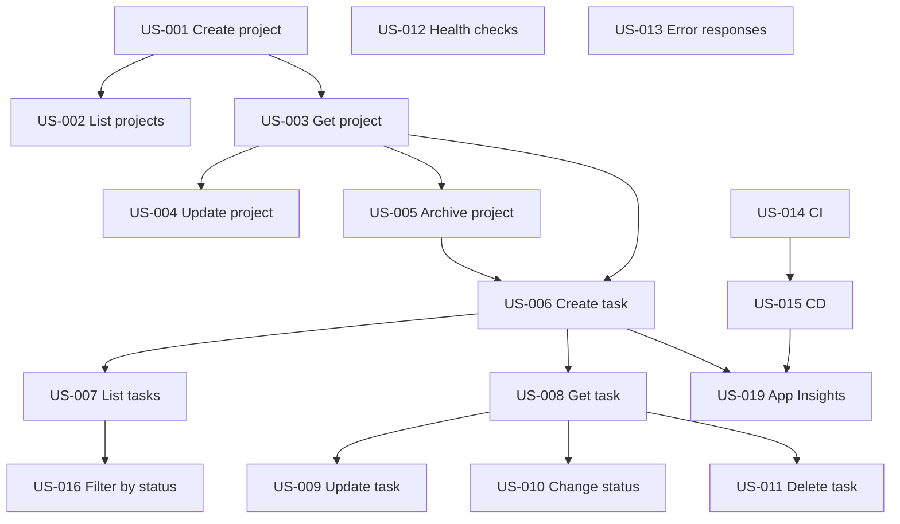

# User Stories Index

## Team Task Board — TNTU Internship 2026

All user stories for the internship project. Stories marked **Must** are required for a passing grade. Stories marked **Could** are optional stretch goals for Week 4.

---

## How to use this index

1. Pick stories in sprint order (Week 1 → Week 4).
2. Create a feature branch per story or per week: `feature/US-001-create-project`.
3. Check off acceptance criteria in the story file as you complete them.
4. Link the pull request to the user story ID in the PR description.

---

## Story template

Each story file follows this structure:

- **Story** — As a / I want / So that
- **Acceptance Criteria** — Given / When / Then
- **API Contract** — HTTP method, path, request/response
- **Technical Notes** — Service, entity, cross-service calls
- **Definition of Done** — Tests, Swagger, deployment
- **References** — Links to docs and domain rules

---

## Projects.Api — Week 1–2

| ID | Title | Service | Priority | Sprint | File |
|----|-------|---------|----------|--------|------|
| US-001 | Create a new project | Projects.Api | Must | Week 1 | [US-001-create-project.md](US-001-create-project.md) |
| US-002 | List all non-archived projects | Projects.Api | Must | Week 1 | [US-002-list-projects.md](US-002-list-projects.md) |
| US-003 | View project details by ID | Projects.Api | Must | Week 1 | [US-003-get-project-by-id.md](US-003-get-project-by-id.md) |
| US-004 | Update project name and description | Projects.Api | Must | Week 2 | [US-004-update-project.md](US-004-update-project.md) |
| US-005 | Archive a project | Projects.Api | Must | Week 2 | [US-005-archive-project.md](US-005-archive-project.md) |

---

## Tasks.Api — Week 2–3

| ID | Title | Service | Priority | Sprint | File |
|----|-------|---------|----------|--------|------|
| US-006 | Create a task in a project | Tasks.Api | Must | Week 2 | [US-006-create-task.md](US-006-create-task.md) |
| US-007 | List all tasks for a project | Tasks.Api | Must | Week 2 | [US-007-list-tasks-by-project.md](US-007-list-tasks-by-project.md) |
| US-008 | View task details by ID | Tasks.Api | Must | Week 2 | [US-008-get-task-by-id.md](US-008-get-task-by-id.md) |
| US-009 | Update task details | Tasks.Api | Must | Week 3 | [US-009-update-task.md](US-009-update-task.md) |
| US-010 | Change task status | Tasks.Api | Must | Week 3 | [US-010-change-task-status.md](US-010-change-task-status.md) |
| US-011 | Delete a task | Tasks.Api | Must | Week 3 | [US-011-delete-task.md](US-011-delete-task.md) |

---

## Platform and Quality — Week 3–4

| ID | Title | Service | Priority | Sprint | File |
|----|-------|---------|----------|--------|------|
| US-012 | Health check endpoints | Both | Must | Week 3 | [US-012-health-checks.md](US-012-health-checks.md) |
| US-013 | Consistent error responses (RFC 7807) | Both | Must | Week 3–4 | [US-013-consistent-error-responses.md](US-013-consistent-error-responses.md) |
| US-014 | GitHub Actions CI — run tests on PR | Both | Must | Week 3 | [US-014-github-actions-ci.md](US-014-github-actions-ci.md) |
| US-015 | GitHub Actions CD — deploy to Azure | Both | Must | Week 3 | [US-015-github-actions-cd.md](US-015-github-actions-cd.md) |
| US-019 | Application Insights observability | Both | Must | Week 3 | [US-019-application-insights.md](US-019-application-insights.md) |

> **Observability:** US-019 introduces Azure Application Insights — see also [Architecture — Observability](../architecture/architecture-and-tech-stack.md#observability).

---

## Optional Stretch Goals — Week 4

| ID | Title | Service | Priority | Sprint | File |
|----|-------|---------|----------|--------|------|
| US-016 | Filter tasks by status | Tasks.Api | Could | Week 4 | [US-016-filter-tasks-by-status.md](US-016-filter-tasks-by-status.md) |
| US-017 | Dockerize each API service | Both | Could | Week 4 | [US-017-dockerize-services.md](US-017-dockerize-services.md) |
| US-018 | Docker Compose for local development | Both | Could | Week 4 | [US-018-docker-compose-local.md](US-018-docker-compose-local.md) |

---

## Dependency graph

---

## Related Documentation

- [System Overview](../domain/system-overview.md)
- [Architecture and Tech Stack](../architecture/architecture-and-tech-stack.md)
- [One-Month Schedule](../internship-plan/one-month-schedule.md)
