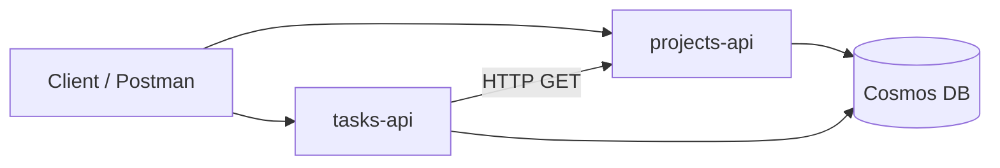

# US-019: Application Insights Observability

## Story

As a **developer**, I want **both APIs to send telemetry to Azure Application Insights**, so that **I can monitor requests, dependencies, failures, and logs in production without attaching a debugger**.

## Acceptance Criteria

### Azure setup

- [ ] Given Azure resources are provisioned, when Application Insights is created, then a single `appi-tntu-taskboard` (or equivalent) resource exists in the resource group.
- [ ] Given both App Services exist, when they are linked to Application Insights, then `APPLICATIONINSIGHTS_CONNECTION_STRING` is set in each app's configuration.
- [ ] Given the free tier, when telemetry is ingested, then daily volume stays within the 5 GB/month allowance (no verbose `Trace` logging in production).

### Telemetry — Projects.Api

- [ ] Given Projects.Api is deployed, when I call any API endpoint, then the request appears in Application Insights **Transaction search** within 2–5 minutes.
- [ ] Given a Cosmos DB operation occurs, when I view the request details, then a **dependency** span for Cosmos DB is recorded.
- [ ] Given an unhandled exception or `500` response, when I open the **Failures** blade, then the failure is listed with exception details.
- [ ] Given code uses `ILogger<T>`, when an `Information` log is written, then the message appears in the request trace or **Logs** view.

### Telemetry — Tasks.Api

- [ ] Given Tasks.Api is deployed, when I create a task, then the request trace shows an **outgoing HTTP dependency** to Projects.Api (`GET /api/v1/projects/{id}`).
- [ ] Given Tasks.Api calls Projects.Api, when the call fails, then the dependency is marked as failed and visible in Transaction search.
- [ ] Given Cosmos DB operations occur, when I view request details, then Cosmos dependencies are recorded.

### Dashboards and demo

- [ ] Given both services have received traffic, when I open **Application map**, then both APIs appear as nodes with Cosmos DB and inter-service HTTP dependency.
- [ ] Given a live demo, when I open **Live Metrics**, then incoming requests are visible in real time.
- [ ] Given the [demo script](../internship-plan/one-month-schedule.md#minimum-viable-demo-script) is executed, when I search transactions, then at least one `POST /api/v1/projects` and one `POST .../tasks` request are found.

## API Contract

Not applicable — this is an infrastructure and instrumentation user story.

## Technical Notes

### Services

Both **Projects.Api** and **Tasks.Api**.

### NuGet packages

```xml
<PackageReference Include="Microsoft.ApplicationInsights.AspNetCore" Version="2.22.0" />
```

Use the latest 2.x version compatible with .NET 8. Verify on [NuGet](https://www.nuget.org/packages/Microsoft.ApplicationInsights.AspNetCore).

### Program.cs registration

```csharp
var builder = WebApplication.CreateBuilder(args);

builder.Services.AddApplicationInsightsTelemetry();

// Existing services...
var app = builder.Build();
```

`AddApplicationInsightsTelemetry()` reads `APPLICATIONINSIGHTS_CONNECTION_STRING` from configuration automatically.

### App Service configuration

| Setting | Value |
|---------|-------|
| `APPLICATIONINSIGHTS_CONNECTION_STRING` | From Application Insights → Overview → Connection string |

Set via Azure Portal (App Service → Settings → Environment variables) or Azure CLI:

```powershell
az monitor app-insights component show `
  --app appi-tntu-taskboard `
  --resource-group rg-tntu-taskboard `
  --query connectionString -o tsv

az webapp config appsettings set `
  --name app-tntu-projects-api `
  --resource-group rg-tntu-taskboard `
  --settings APPLICATIONINSIGHTS_CONNECTION_STRING="<connection-string>"
```

Repeat for `app-tntu-tasks-api`.

### Structured logging

Replace string interpolation with structured templates so properties are searchable in Application Insights:

```csharp
// Preferred
_logger.LogInformation("Project {ProjectId} created with name {ProjectName}", project.Id, project.Name);

// Avoid (harder to query)
_logger.LogInformation($"Project {project.Id} created with name {project.Name}");
```

### Key dependencies auto-collected

| Dependency | Triggered by |
|------------|--------------|
| `Http` | `HttpClient` call from Tasks.Api to Projects.Api |
| `Azure DocumentDB` / `Cosmos` | EF Core Cosmos DB provider operations |
| `Request` | Incoming API calls |

### Application map expected topology



### Sampling

Application Insights uses adaptive sampling by default in ASP.NET Core. For the internship demo, default sampling is sufficient. Do not disable sampling in production without mentor approval.

### Local development

- Do **not** set `APPLICATIONINSIGHTS_CONNECTION_STRING` in committed `appsettings.Development.json`.
- Use [User Secrets](https://learn.microsoft.com/en-us/aspnet/core/security/app-secrets) if you want to test telemetry locally against a dev Application Insights resource.

### Relationship to other stories

| Story | Relationship |
|-------|--------------|
| [US-012](US-012-health-checks.md) | `/health` requests appear as low-value telemetry; exclude from alerts if needed |
| [US-013](US-013-consistent-error-responses.md) | `4xx`/`5xx` responses appear in Failures; Problem Details `detail` helps debugging |
| [US-015](US-015-github-actions-cd.md) | Deploy first, then verify telemetry in Azure |

## Definition of Done

- [ ] Application Insights resource provisioned and linked to both App Services
- [ ] `Microsoft.ApplicationInsights.AspNetCore` added to both projects
- [ ] `AddApplicationInsightsTelemetry()` registered in both `Program.cs` files
- [ ] Structured `ILogger` calls added to at least create-project and create-task code paths
- [ ] Transaction search shows requests after demo script run
- [ ] Application map shows both services and dependencies
- [ ] Screenshot of Application map or Transaction search included in final presentation
- [ ] README updated with link to Application Insights resource (name only, no secrets)

## References

- [Application Insights overview](https://learn.microsoft.com/en-us/azure/azure-monitor/app/app-insights-overview)
- [Enable Application Insights for ASP.NET Core](https://learn.microsoft.com/en-us/azure/azure-monitor/app/asp-net-core)
- [Application Insights connection strings](https://learn.microsoft.com/en-us/azure/azure-monitor/app/sdk-connection-string)
- [Log in ASP.NET Core with Application Insights](https://learn.microsoft.com/en-us/azure/azure-monitor/app/ilogger)
- [Monitor dependencies in Application Insights](https://learn.microsoft.com/en-us/azure/azure-monitor/app/asp-net-dependencies)
- [Application map in Azure Monitor](https://learn.microsoft.com/en-us/azure/azure-monitor/app/app-map)
- [Live Metrics stream](https://learn.microsoft.com/en-us/azure/azure-monitor/app/live-stream)
- [Analyze failures in Application Insights](https://learn.microsoft.com/en-us/azure/azure-monitor/app/failures-performance-properties)
- [Monitor Azure App Service with Application Insights](https://learn.microsoft.com/en-us/azure/azure-monitor/app/azure-web-apps-overview)
- [Application Insights pricing (free tier)](https://learn.microsoft.com/en-us/azure/azure-monitor/app/pricing)
- [Architecture — Observability](../architecture/architecture-and-tech-stack.md#observability)
